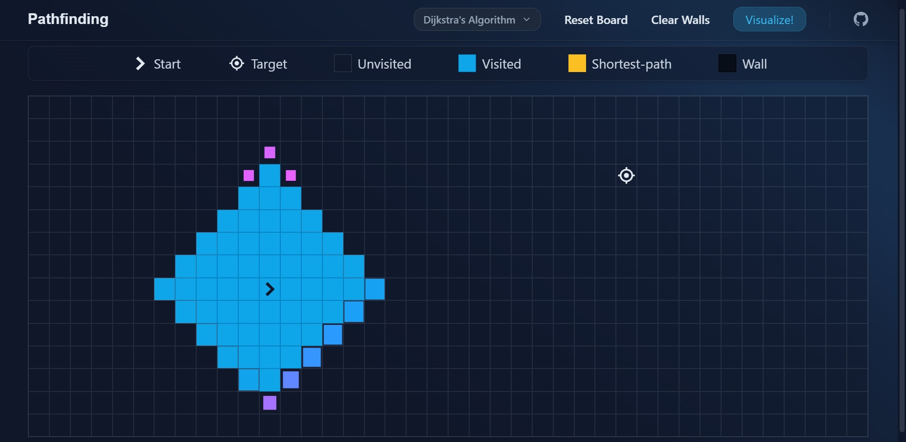

# Pathfinding Visualizer

Visualize the different pathfinding algorithms with this web-based tool!

<hr>

## Quick Start

The easiest way to get started is to visit the demo website, where you can play around with this visualization tool.  
[https://0l1v3rr.github.io/pathfinding-visualizer](https://0l1v3rr.github.io/pathfinding-visualizer)



<hr>

## Algorithms

The following algorithms are currently supported by the application:

- **[Dijkstra's algorithm](https://en.wikipedia.org/wiki/Dijkstra%27s_algorithm):** An algorithm for finding the shortest paths between nodes in a graph, such as a road network. It was conceived by the computer scientist Edsger W. Dijkstra in 1956 and published three years later.
<!-- - **[A\* search](https://en.wikipedia.org/wiki/A*_search_algorithm):** A graph traversal and path search algorithm used in many areas of computer science due to its completeness, optimality, and optimal efficiency. Unlike Dijkstra's algorithm, the A\* algorithm finds only the shortest path from a given source to a given destination, rather than the shortest path tree from a given source to all possible destinations. -->
- **[Breadth First Search](https://www.geeksforgeeks.org/breadth-first-search-or-bfs-for-a-graph/):** The Breadth First Search (BFS) algorithm is used to search a tree or graph data structure for a node that meets a set of criteria. It starts at the root of the tree or graph and searches/visits all nodes at the current depth level before moving on to the nodes at the next depth level. Breadth-first search can be used to solve many problems in graph theory.
- **[Depth First Search](https://www.geeksforgeeks.org/depth-first-search-or-dfs-for-a-graph/):** An algorithm for traversing or searching tree or graph data structures. The algorithm starts at the root node (in the case of a graph, selecting any node as the root node) and explores as far as possible along each branch before backtracking.

<hr>

## Building from source

If you don't have NodeJS, [download and install it](https://nodejs.org/en/).  
Then open a terminal and type the following commands:

```sh
# Clone the project:
git clone https://github.com/0l1v3rr/pathfinding-visualizer.git
cd pathfinding-visualizer

# Install the dependencies:
npm i

# Run the application:
npm start
```

<hr>

## Contributing

All contributions are welcomed.  
You can find a contributing guideline [here](CONTRIBUTING.md).  
This project is released under the [MIT License](LICENSE).

## Inspiration

This project was inspired by [Clément Mihailescu](https://github.com/clementmihailescu).
